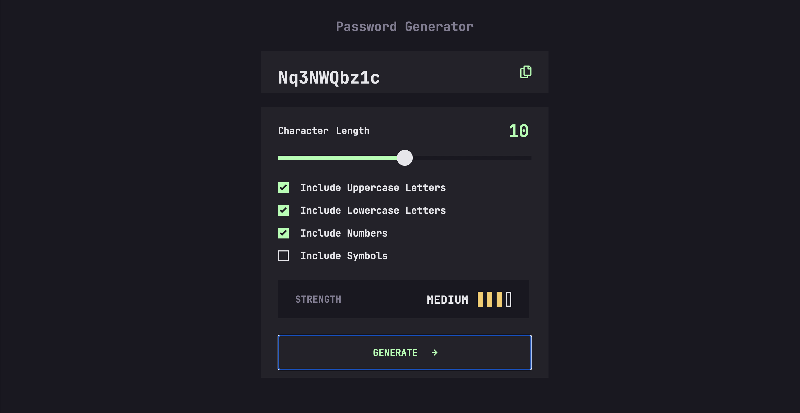

# Frontend Mentor - Password generator app solution

This is a solution to the [Password generator app challenge on Frontend Mentor](https://www.frontendmentor.io/challenges/password-generator-app-Mr8CLycqjh). Frontend Mentor challenges help you improve your coding skills by building realistic projects.

## Table of contents

- [The challenge](#the-challenge)
- [Screenshot](#screenshot)
- [Links](#links)
- [Built with](#built-with)
- [What I learned](#what-i-learned)

## Overview

### The challenge

Users should be able to:

- View the optimal layout for the site depending on their device's screen size

### Screenshot

### Links

- Solution URL: [https://github.com/tunaerten/password-generator]
- Live Site URL: [https://password-generator-erten.netlify.app]

## My process

### Built with

- Semantic HTML5 markup
- CSS custom properties
- Flexbox
- CSS Grid
- Mobile-first workflow
- JavaScript

### What I learned

To be honest, it wasn’t an easy project. At first, I struggled with styling SVG images in CSS. But now, I can say I fully understand it, which was a good experience for me.

The JavaScript side was quite fun. I had done a similar project before, but I still had to do a lot of research on Stack Overflow. I guess that’s a normal part of the process. Unfortunately, information that I don’t use doesn’t stay fresh in my mind.

The most challenging part was deciding which method to use for getting letters and numbers. Initially, I wanted to use the fromCharCode function, but I couldn’t achieve exactly what I wanted. Instead, I made each character into an array, which worked.

Similarly, it took me a while to come up with the idea of making the colors and different strengths of colors into objects.

To make the project look a bit more realistic, I also added an animation and an error statement.
